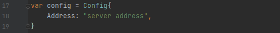

# afd

docker 自动打包脚本

### 如何打包成.exe文件

```shell
# 会输出 afd.exe 文件

go build
```

### 如何使用
#### windows下
把`go build`后的exe文件路径加到系统路径中即可，然后命令afd会出现提示


### 打包成可执行文件需要注意

更改默认的服务器名称，登录私有仓库适用于非第一次登录，如果首次使用，建议手动先登录一次私有仓库，以免报错！


